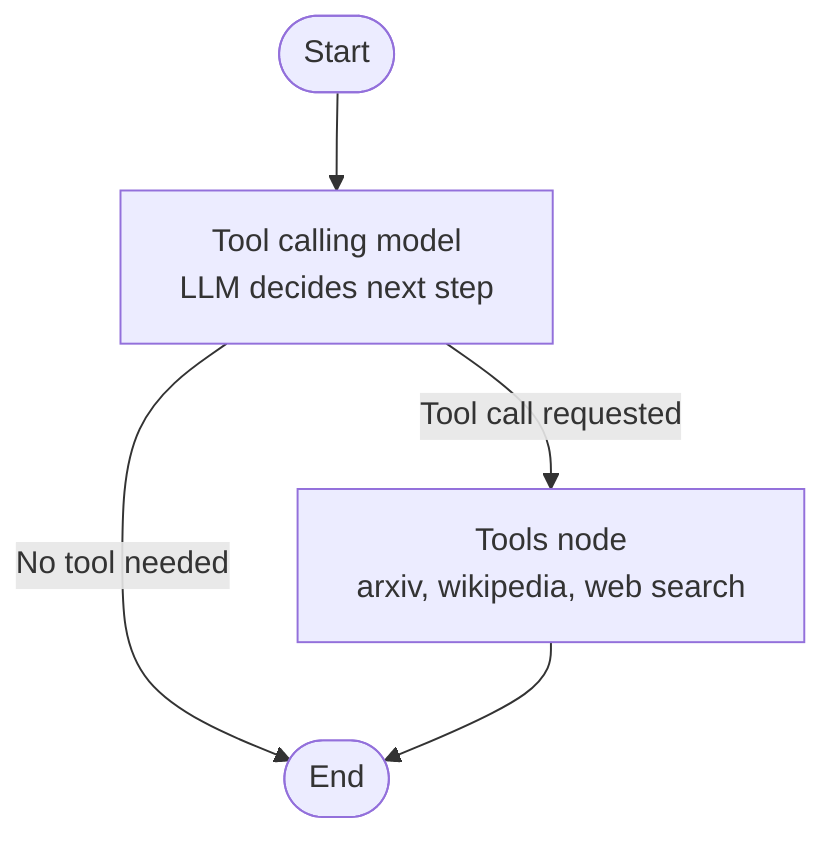

# Multi-Tool Agentic Chatbot — LangGraph

An agentic AI chatbot built with LangGraph that autonomously decides which tool to use based on the user's query — academic paper search, general knowledge lookup, or live web search.

Unlike a simple chatbot that just calls an LLM, this agent reasons about *what kind of information it needs* and *which tool can get it*, then routes the query accordingly.

## How It Works

1. User sends a message
2. LLM (Groq's Qwen3-32B) analyzes the query and decides if a tool is needed
3. If yes — LangGraph routes to the appropriate tool node
4. Tool executes and returns results
5. Agent incorporates tool results into final response

## Workflow



## Tools

| Tool | Purpose | Source |
|---|---|---|
| `arxiv_search` | Academic papers, research, scientific publications | arXiv API |
| `wiki_search` | General knowledge, factual lookups | Wikipedia API |
| `tavily` | Real-time web search, current events, news | Tavily Search API |

The agent decides which tool (if any) fits the query — no manual routing or keyword matching.

## Example Interactions

**Query:** "What is Machine Learning?"
→ Agent calls `wiki_search` → returns Wikipedia summary

**Query:** "Attention is all you need"
→ Agent recognizes the paper reference, responds directly with context (no tool call needed since it's general knowledge it already has)

**Query:** "Provide me the top 10 AI news for today"
→ Agent calls `tavily` (real-time web search) since this requires current information

This demonstrates the agent's ability to distinguish between general knowledge, research-paper queries, and time-sensitive information.

## Setup

### 1. Install dependencies

```bash
pip install langchain langgraph langchain-community arxiv wikipedia python-dotenv
```

### 2. Get API Keys

| Service | Where to get it |
|---|---|
| Groq | [console.groq.com](https://console.groq.com) — free tier |
| Tavily | [tavily.com](https://tavily.com) — free tier |

### 3. Set Environment Variables

Create a `.env` file:

```
GROQ_API_KEY=your_groq_api_key
TAVILY_API_KEY=your_tavily_api_key
```

### 4. Run

Open `6-ChatbotWithMultipleTools.ipynb` in Jupyter and run all cells.

## Architecture

**State Schema:**
```python
class State(TypedDict):
    messages: Annotated[list[AnyMessage], add_messages]
```

**Graph Construction:**
```python
builder = StateGraph(State)
builder.add_node("tool_calling_model", tool_calling_model)
builder.add_node("tools", ToolNode(tools))
builder.add_edge(START, "tool_calling_model")
builder.add_conditional_edges("tool_calling_model", tools_condition)
builder.add_edge("tools", END)
```

The `tools_condition` function automatically checks if the LLM's response contains a tool call — if yes, routes to the tools node; if no, the conversation ends.

## Requirements

- Python 3.10+
- langchain
- langgraph
- langchain-community
- arxiv
- wikipedia
- python-dotenv

## What I Learned

- LangGraph `StateGraph` — nodes, edges, conditional routing
- Tool binding with `model.bind_tools()`
- Custom tool creation using the `@tool` decorator
- Agent decision-making — when to call a tool vs. respond directly
- `ToolNode` and `tools_condition` for automatic tool execution
- Multi-source information retrieval (arXiv, Wikipedia, live web search)
- State management with `TypedDict` and `add_messages` reducer
